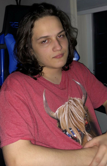

# About Me

* Most of my coding experience has been related to making **video games**. I started with game development on an engine called Godot using a Python based language called GDScript. In the Software class I was able to also make a game used Unreal Engine and the langauge Blueprint. This was also my first introduction on how to use Github but it was not used to its full potential in this project.

* In this class I hope to learn more about how to manage a project as that is something I have never really learned how to do from the other CS classes. That skill will definitely carry on to any project I decide to do no matter the engine or language.

#

_Picture of me_

